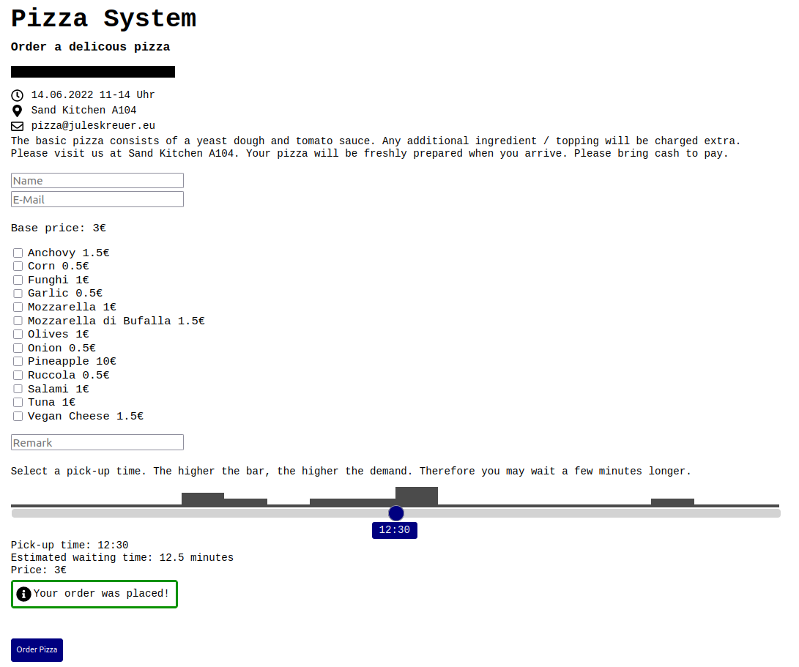

# Pizza System
A website for small events to order pizzas and manage those orders.

## Setup
Requires a PHP-Webserver with SQL. 
### Database
Edit `database.sql`.
You can add or remove possible toppings.
Example: `(12, 'Pineapple', 10),`: Topping number 12 are pineapples which costs 10€.

Creata a database and run the `database.sql` file.
### PHP
Edit  `config.php` to your needs.  Upload everything to your server.
You may want to add a password protection to the `admin.php` using the `.htacces` file. 

## Example
</img>